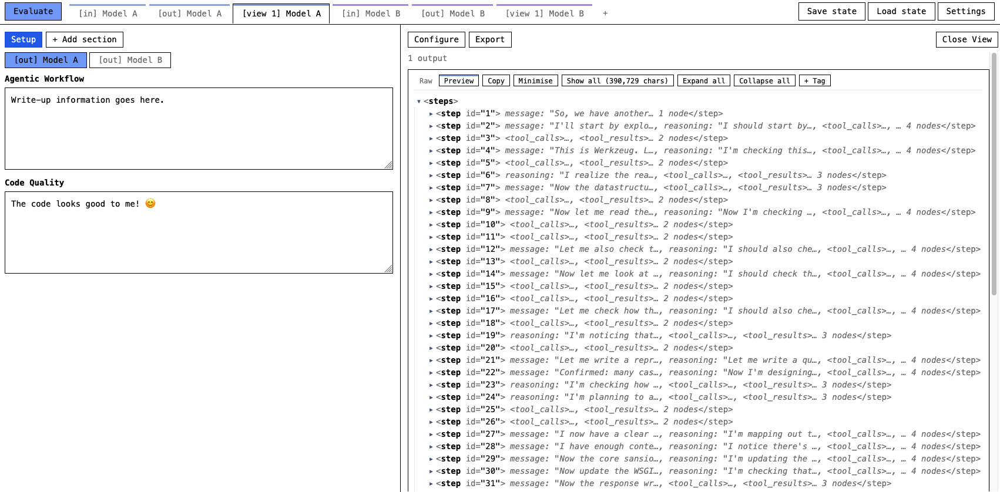
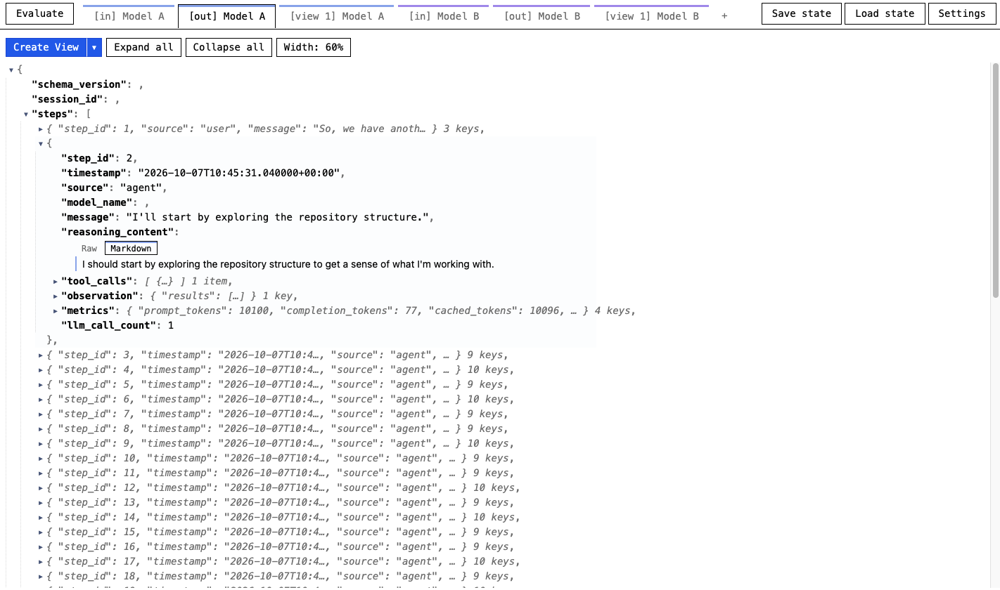
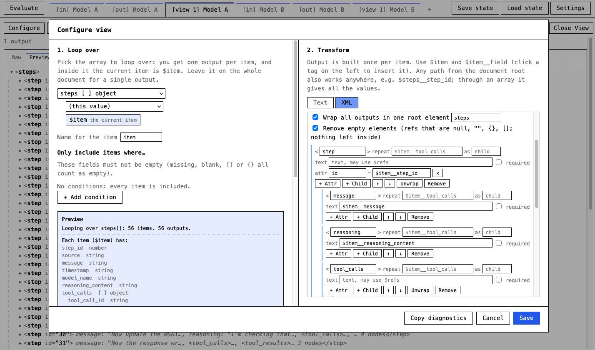
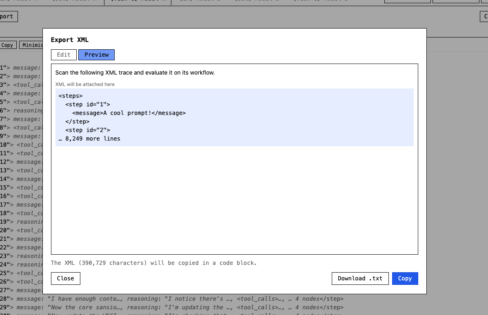

# JSON Trajectory Viewer

An app for viewing, comparing and evaluating JSON LLM trajectories.

XML is chosen as an output format because it works well when passed to an LLM for automated analysis.

## Running

Serve the directory with Python's built-in web server, then open <http://localhost:8000>:

```sh
python3 -m http.server
```

## Screenshots



*Evaluating: the Evaluate sidebar holds a write-up alongside the data being reviewed.*



*Viewing JSON: rendered as browsable trees.*



*XML view config: configure how JSON is converted to XML (select -> transform).*



*XML export: the generated XML. The preamble at the top is a prompt, included so the output can be pasted straight into an LLM.*
